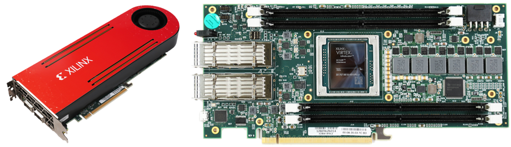
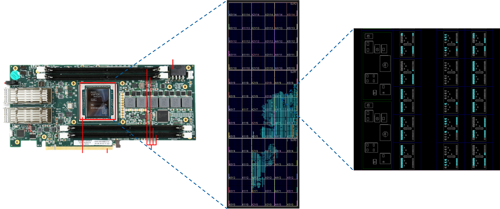
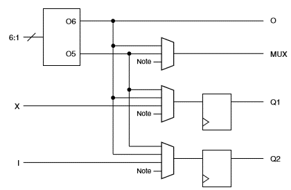

# 什么是FPGA？

## 基本概念

FPGA(Field Programmable Gate Array)的中文译名是现场可编程门阵列。FPGA的功能是模拟绝大部分CMOS电路的行为，因此可以作为电路设计的验证工具。广义上说，FPGA也是一种通用芯片，可以实现任何功能。现在的FPGA通过定制功能，可以在很多领域达到超过通用芯片的性能，因此也在逐步地被应用到实际产品中。其具体的发展历史和应用可以参考[wikipedia](https://en.wikipedia.org/wiki/Field-programmable_gate_array)或其他资料。

从实物入手通常会更加容易理解。下图展示的是Xilinx VCU1525型号的FPGA板卡。这是一款可以像显卡一样插在PCIe接口上的FPGA板卡。其中包含了一块型号为VU9P的FPGA芯片，用于插内存的DIMM卡槽，光通信接口以及一系列的外围电路。

```
注意区分FPGA板卡和FPGA芯片，以及它们的型号，不要混用。
```



## 内部单元

FPGA芯片由一些统一的基本单元构成。在Vivado中，我们可以在device窗口看到官方给出的一个对FPGA芯片内部结构的图形化表述，如下图所示。尽管这不是芯片的照片，但还是反映出了FPGA的一些基本特征。



FPGA内部由一些相同的“块”构成，每个块内部又包含不同的列，每一列内部包含一种逻辑单元。逻辑单元之间通过互连线以及开关提供任意的连接方式。现代的FPGA主要由以下几种逻辑单元构成：
- 查找表和寄存器 (LUT & register)
- 缓存 (Block RAM)
- 数字处理单元 (DSP)

除此之外，我们还会关心一些很有限的资源，比如PLL，I/O，BUFG等等。关于这些概念可以自行查阅相关资料。

### 查找表(LUT)和寄存器(register)


通常，查找表和寄存器会绑定在一起，因此我们也一起介绍。上图是Xilinx的User Guide给出的简单框图。任何组合逻辑都可以通过真值表的方式来实现。因此将真值表烧写到RAM中作为查找表是一种通用的实现逻辑的方式。Xilinx的FPGA中通常采用6输入1输出（可配置为5输入2输出）的查找表作为基本的单元。对于需要更多输入的逻辑，可以采用查找表级联的形式来实现。

查找表后面通常会级联寄存器，将组合逻辑的输出及时地寄存，以保证电路的整体性能。在Xilinx的FPGA中，LUT和register的比例通常是1:2。

### 缓存(Block RAM)

### 数字处理单元(DSP)

## 性能
