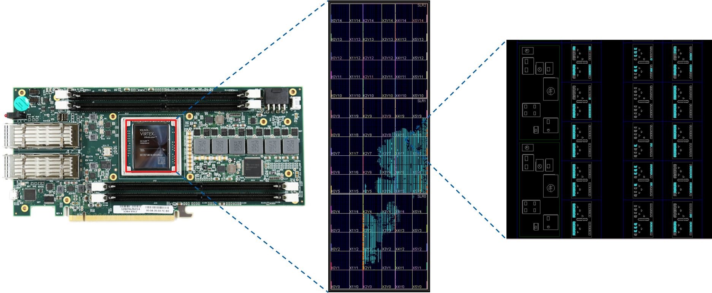

# 什么是FPGA？

## 1. 基本概念

FPGA(Field Programmable Gate Array)的中文译名是现场可编程门阵列。FPGA可以实现绝大部分CMOS电路的行为，因此可以作为电路设计的验证工具。广义上说，FPGA也是一种通用芯片，可以实现任何功能。现在的FPGA通过定制功能，可以在很多领域达到超过通用芯片的性能，因此也在逐步地被应用到实际产品中。其具体的发展历史和应用可以参考[wikipedia](https://en.wikipedia.org/wiki/Field-programmable_gate_array)或其他资料。

下图展示的是Xilinx VCU1525型号的FPGA板卡。这是一款可以像显卡一样插在PCIe接口上的FPGA板卡。其中包含了一块型号为VU9P的FPGA芯片，用于插内存的DIMM卡槽，光通信接口以及一系列的外围电路。

```
注意：区分FPGA板卡和FPGA芯片，以及它们的型号，不要混用。
```


## 2. 内部结构

FPGA芯片由一些统一的基本单元构成。在Vivado中，我们可以在device窗口看到官方给出的一个对FPGA芯片内部结构的图形化表述，如下图所示。尽管这不是芯片的照片，但还是反映出了FPGA的一些基本特征。



FPGA内部由一些相同的“块”构成，每个块内部又包含不同的列，每一列内部包含一种逻辑单元。逻辑单元之间通过互连线以及开关提供任意的连接方式。现代的FPGA主要由以下几种逻辑单元构成：
- 查找表和寄存器 (LUT & register)
- 缓存 (Block RAM)
- 数字处理单元 (DSP)

除此之外，我们还会关心一些很有限的资源，比如PLL，I/O，BUFG等等。关于这些概念可以自行查阅相关资料。

### 2.1. 查找表(LUT)和寄存器(register)


通常，查找表和寄存器会绑定在一起，因此我们也一起介绍。上图是Xilinx的User Guide给出的简单框图。任何组合逻辑都可以通过真值表的方式来实现。因此将真值表烧写到RAM中作为查找表是一种通用的实现逻辑的方式。Xilinx的FPGA中通常采用6输入1输出（可配置为5输入2输出）的查找表作为基本的单元。对于需要更多输入的逻辑，可以采用查找表级联的形式来实现。

查找表后面通常会级联寄存器，将组合逻辑的输出及时地寄存，以保证电路的整体性能。在Xilinx的FPGA中，查找表和寄存器的比例通常是1:2。在不使用寄存器进行大量的数据存储时，通常寄存器的资源是足够的。而需要存储数据时，也可以将查找表配置为RAM来使用。FPGA中的LUT数量在几万到几十万不等，仅作为存储也有不小的规模。

### 2.2. 缓存(Block RAM)


缓存(Block RAM)是FPGA中最重要的存储单元，通常用BRAM来简称。最新的FPGA可包含接近100MB的BRAM，远远超过一般的CPU或GPU的cache大小。FPGA中的缓存通常是真双端口(true dual port)缓存，包含两组读写口，每一组端口可以时分复用地读或写。

FPGA中的缓存通常为统一大小的块。Xilinx的缓存的基本粒度为36bit宽，深度为512，视为0.5个BRAM。实际使用时可以根据需要配置成更窄的位宽以及更大的深度。当设计使用的缓存大小超过0.5个BRAM时，综合工具会自动将其映射到多个BRAM上。最新的Xilinx FPGA还包含了72-bit宽，深度为4096的Ultra RAM来针对大容量片上存储的需求。

### 2.3. 数字处理单元(DSP)


数字处理单元(DSP)是用来进行整数的数学运算的。其基本的功能包括整数的加法、累加、乘法等。上图是Xilinx的FPGA中DSP的基本结构。可以以流水线的形式完成完成```(A+D)*B+C```的功能。尽管这样的功能也可以用查找表和寄存器来实现，但是采用DSP单元，在面积与时序上都会更优。一些其他功能的IP，例如浮点计算的IP，也会尽可能借助DSP单元来实现功能。

FPGA中的DSP数量在几百到几千不等，因此FPGA在计算上可以提供极高的并行度。

## 3. FPGA SoC系统

### 3.1. CPU

目前很多的FPGA，如Xilinx的Zynq 7000和UltraScale MPSoC以及Versal系列，都在芯片上集成了ARM架构的CPU。为系统设计带来了便利，一方面基于CPU可以快速搭建DEMO。另一方面，一些不利于FPGA实现的功能可以在片上集成的CPU上实现，两者形成互补，为方案设计提供更大的选择空间。Xilinx的术语中，通常将SoC中的CPU成为PS（Processing System），将FPGA部分称为PL（Programmable Logic）。


PS和PL之间的接口非常丰富，常用的有：
* AXI-Master接口提供了PS访问PL的读写接口，该接口以地址映射的形式连接PL上的各种逻辑单元。
* HP接口提供了FPGA访问CPU侧内存的接口，通过该接口，PL侧的逻辑单元通过物理地址直接访问CPU的内存，从而实现高效的数据交互。
* 时钟和复位：PS侧可以为PL侧提供多个可配置的参考时钟以及复位信号。
* 中断：PS和PL可以互相提供中断信号。
* EMIO：PS侧直接和PL侧连接的可配置IO接口

### 3.2. HBM

最新的FPGA，如Xilinx的VU3xP系列在芯片内集成了HBM存储，用以替代片外的DDR内存，同时提供更大的带宽（一般大于100GB/s）。

### 3.3. 硬核接口

### 3.4. Adaptive Engine

Xilinx最新的Versal系列芯片进一步强化了SoC的概念。

## 4. 性能

相比于CPU和GPU，FPGA的主频很低，通常在100-200MHz。最新的FPGA可以运行在300MHz以上，但也很难超过400MHz。因此单纯就运算速度而言，基于FPGA的硬件设计必须有足够的并行度或其他优化手段才可以和CPU以及GPU匹敌。

相对于通用计算平台，FPGA的硬件设计冗余更小，提供相同的功能，只需要很低的功耗。低端的FPGA的功耗可以在5W以内，而高端的FPGA通常也不会超过100W。

## 5. 参考资料

关于FPGA的各种组成单元，Xilinx官方的User Guide有着较为详细的说明。可供参考：
- 缓存：[UG573](https://china.xilinx.com/support/documentation/user_guides/ug573-ultrascale-memory-resources.pdf)
- 查找表和寄存器：[UG574](https://china.xilinx.com/support/documentation/user_guides/ug574-ultrascale-clb.pdf)
- 数字处理单元：[UG579](https://china.xilinx.com/support/documentation/user_guides/ug579-ultrascale-dsp.pdf)
