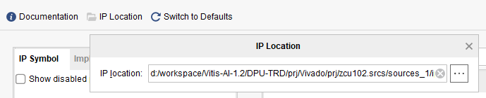

# 使用Git管理Vivado工程

## 文件夹结构

这里只给出一个参考，可以根据实际情况调整。
```
<项目名称>
  | （以下内容是必须的）
  |-- README.md     // 项目的基本信息：项目的基本功能，如何使用这个工程，一些基本的profiling等
  |-- .gitignore    // 不需要git维护的文件列在此处
  |-- src           // 所有的源文件：.v, .sv, .vh, .c, .cpp, .h等等
  |    |-- ip       // IP文件夹
  |    |    |
  |    |    |-- ip_name     // 存放ip_name.xci
  |    |
  |    |-- <as-you-like>    // 按照喜好维护剩下的源文件
  |
  |-- sim           // 所有的仿真文件：.v, .sv, .vh, .c, .cpp, .h等等
  |
  |-- doc           // 如果除了README.md还有需要详细说明的东西，放在这里
  |    |            // 可以在README.md里链接到此文件夹中的文件
  |    |-- img      // 如果markdown中画了一些图，可以在此处保存源文件以及导出的图片
  |
  |-- scripts       // 用于建立工程或实现特定功能的脚本，可以在Vivado中导出，或者手写shell/tcl脚本
  |-- <as-you-like> // 其他需要维护的东西，比如Makefile
  |
  | （以下内容不要用git维护）
  |-- prj           // Vivado或HLS工程文件夹，尽量通过脚本自动创建，维护脚本即可
  |-- reports       // 仿真、综合报告等
```

## gitignore样例
```
# ignore vscode settings
.vscode

# ignore log files
*.log
*.jou
*.str
*.bak

# ignore vivado project and report folder
prj
reports

# ignore xilinx folder folder
.Xil

# manage the generated xilinx ip
src/ip/**/*.*
!src/ip/**/*.xci
```

## 通过脚本自动生成Vivado工程

参考内容：http://xilinx.eetrend.com/content/2020/100047180.html

Vivado工程中通常包含大量的非文本文件，如例化的IP以及Block Design等。这些文件或是工程本身都可以通过tcl脚本来自动生成，因此我们可以采用维护tcl脚本辅助的方式来维护工程。维护工程的核心思路是分开管理项目、源文件以及脚本。项目的基本结构如下：

我们在prj文件夹下新建一个工程project_1，进入vivado IDE界面后我们在Tcl Console中输入如下指令：

``` tcl
write_project_tcl {../scripts/create_prj.tcl}
```

以后拿到Git工程时，运行```vivado -source ./scripts/create_prj.tcl```即可建立工程。当工程有大变动时，需要重新生成这个文件。用户也可以仿照这个文件自己按照tcl的语法来写。

## 管理Vivado IP

在Vivado中调用IP会产生非常多的文件，这些文件并不都需要通过git来维护，只要是相同版本的vivado，通过.xci文件即可生成IP，因此维护.xci文件即可。上述.gitignore文件样例中已经写明了如何只保留/src/ip/下面的.xci文件同时忽略其他文件。

用户可以选择将.xci文件从生成IP的位置拷贝到/src/ip/<ip_name>/下，但这不是一个好的做法。因为每次IP的配置变动时，用户都要手动更新，容易出现遗漏。另一种做法是在生成IP的时候，手动选择IP Location：



此时IP会自动在指定位置生成。对于我们的文件夹结构，应该选择/src/ip/。需要注意的是，block design中的ip不需要以此方法维护。

## 管理Block Design

在Vivado中采用block design进行开发时，可以在File->Export->Export Block Design中将设计导出为tcl文件，保存在scripts中。

## 管理IP工程

（待补充）