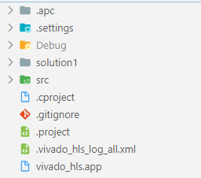

# 使用Git来管理FPGA工程

代码开发过程中实行版本管理是非常必要的。Git作为目前较为主流的版本管理工具，在程序员中非常普及。个人用户也可以在GitHub上享受到免费的仓库服务。但是对于FPGA项目，项目文件中非文本文件多，且体积大，因此不适合直接采用Git维护所有文件。因此在维护时需要采用一些辅助手段。

## 一个通用的文件夹结构

这里只给出一个参考，可以根据实际情况调整。
```
<项目名称>
  | （以下内容是必须的）
  |-- README.md     // 项目的基本信息：项目的基本功能，如何使用这个工程，一些基本的profiling等
  |-- .gitignore    // 不需要git维护的文件列在此处
  |-- src           // 所有的源文件：.v, .sv, .vh, .c, .cpp, .h等等
  |    |-- lib      // 如果有外部库，可以单独放在一起
  |    |            // （可以选择不维护库文件，通过README或脚本来指示如何获取这些文件）
  |    |-- <as-you-like>    // 按照喜好维护剩下的源文件
  |-- sim           // 所有的仿真文件：.v, .sv, .vh, .c, .cpp, .h等等
  |
  | （以下内容不是必须的）
  |-- doc           // 如果除了README.md还有需要详细说明的东西，放在这里
  |    |            // 可以在README.md里链接到此文件夹中的文件
  |    |-- img      // 如果markdown中画了一些图，可以在此处保存源文件以及导出的图片
  |-- scripts       // 用于建立工程或实现特定功能的脚本，可以在Vivado中导出，或者手写shell/tcl脚本
  |-- reports       // 一些必要的需要保存的报告（如果生成时间很短，可以不用git维护）
  |-- <as-you-like> // 其他需要维护的东西
  |
  | （以下内容尽量不要用git维护）
  |-- prj           // Vivado或HLS工程文件夹，尽量通过脚本自动创建，维护脚本即可
```

## Vivado工程

参考内容：http://xilinx.eetrend.com/content/2020/100047180.html

Vivado工程中通常包含大量的非文本文件，如例化的IP以及Block Design等。这些文件或是工程本身都可以通过tcl脚本来自动生成，因此我们可以采用维护tcl脚本辅助的方式来维护工程。维护工程的核心思路是分开管理项目、源文件以及脚本。项目的基本结构如下：

我们在prj文件夹下新建一个工程project_1，进入vivado IDE界面后我们在Tcl Console中输入如下指令：

``` tcl
write_project_tcl {../scripts/create_prj.tcl}
```

## petalinux工程
参考内容：[UG1144](https://www.xilinx.com/support/documentation/sw_manuals/xilinx2019_1/ug1144-petalinux-tools-reference-guide.pdf)，官方目前正在完善版本管理流程，以下内容仅供参考。

1. 建立petalinux工程并初始化
   ``` bash
   petalinux-create -t project --name <prj-name> --template zynqMP # or any way you like
   cd <prj-name>
   git init
   ```
2. petalinux已经默认提供了.gitignore文件，内容如下：
   ```
   */*/config.old
   */*/rootfs_config.old
   build/
   images/linux/
   pre-built/linux/
   .petalinux/*
   !.petalinux/metadata
   *.o
   *.jou
   *.log
   project-spec/meta-plnx-generated/
   /components/plnx_workspace
   ```
3. 在git commit之前，使用如下命令清理工作区。但是这可能会导致下一次petalinux-build的时间大幅增加，所以目前应该避免频繁提交。
   ``` bash
   petalinux-build -x mrproper
   ```

## HLS工程

1. 建立HLS工程并初始化
   ``` bash
   cd <project-root>
   git init
   ```

2. 添加.gitignore文件
   ```
   Debug/
   # 综合及仿真文件可以忽略，但是directive要保留，注意这里默认solution的名称为   solution1,2...
   solution*/csim
   solution*/impl
   solution*/sim
   solution*/syn
   solution*/.autopilot
   solution*/.debug
   solution*/.tcls
   # 忽略所有log文件
   *.log
   ```

3. 添加源文件建议在工程的根目录下建立src文件夹存储所有源文件，可以考虑单独建立sim文件夹存放测试程序。此时的文件夹结构如下：
   
   